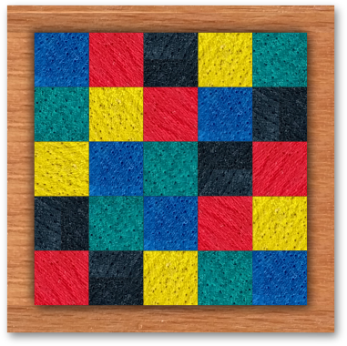

# Five Colors
You are given a wooden board and nine stones. Can you arrange all stones in the board such that in every row and in every column each color occurs only once?

If you fail to find a solution on your own, the five-colors application can do all the hard work for you.
**Spoiler alert: Reading the section below reveals the solution.**

## Solution
```
$ solve-five-colors...
Found 164 layouts of which 24 are unique layouts.
Solution:
(1,1, vertical) blue green yellow
(1,2, vertical) yellow red
(1,3, horizontal) red black green
(2,3, horizontal) black blue yellow
(3,2, horizontal) blue green
(3,4, vertical) red yellow green
(3,5, vertical) black red blue
(4,1, horizontal) black green blue
(5,1, horizontal) red black yellow
Rotate and mirror this solution to produce variants of it.
--------------------
| B | Y | R | D | G |
| G | R | D | B | Y |
| Y | B | G | R | D |
| D | G | B | Y | R |
| R | D | Y | G | B |
--------------------
Board is valid and full.
Found 1 solution(s) in total.
Done after 12 ms.
```


